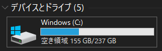

# diskusage

This is a tiny tool to show the diskusage of the Windows.  
This tool was created for Windows environments where you cannot casually type "df -h" to check disk space.

## Install

### Scoop

First, add my scoop-bucket.

```sh
scoop bucket add kemokemo-bucket https://github.com/kemokemo/scoop-bucket.git
```

Next, install this app by running the following.

```sh
scoop install diskusage
```

### Binary

Get the latest version from [the release page](https://github.com/kemokemo/diskusage/releases/latest), and download the archive file for your operating system/architecture. Unpack the archive, and put the binary somewhere in your `$PATH`.

## Usage

```sh
$ diskusage
## IEC size (like Windows)
Total: 237 GiB, Free: 156 GiB, Available: 156 GiB
## SI size
Total: 255 GB, Free: 167 GB, Available: 167 GB
```


